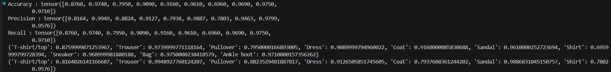

# AI-based Image Classifier for an E-commerce Retailer

## Overview
AI Image Classifier is a deep learning project designed to classify product images for e-commerce applications. Built with PyTorch, it leverages convolutional neural networks (CNNs) and the FashionMNIST dataset to demonstrate robust multiclass image classification. The project includes model training, evaluation, and visualization of results, making it a practical resource for machine learning enthusiasts and retail data scientists.

## Features
- Uses PyTorch and TorchMetrics for model development and evaluation
- Loads and preprocesses FashionMNIST dataset
- Defines a custom CNN architecture
- Trains the model for multiclass classification
- Evaluates accuracy, precision, and recall (overall and per class)

## Model Architecture
- **Feature Extractor:**
  - 2 convolutional layers (32 and 64 filters)
  - ELU activation
  - Max pooling
  - Flatten layer
- **Classifier:**
  - Fully connected layer for 10 classes

## Results
The notebook prints overall and per-class accuracy, precision, and recall after model evaluation.

